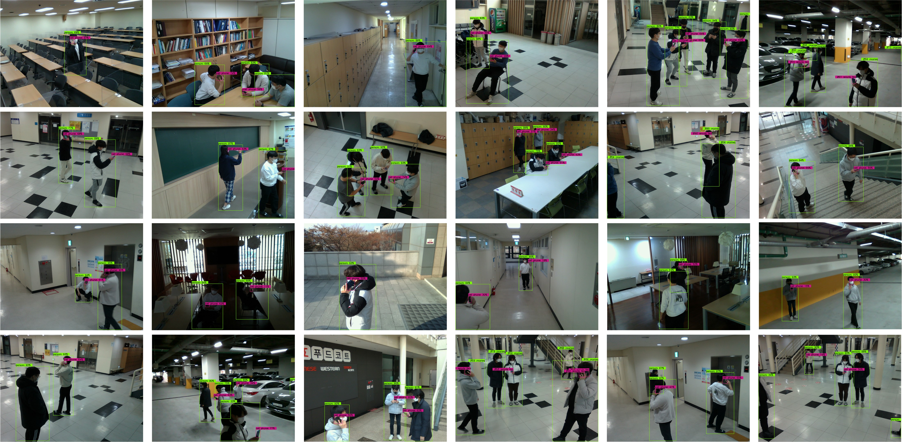

# VOBEM1: Vision Objects for Beam Management (Version 1)

VOBEM1 is a vision dataset specially designed for the evaluation of the single-view computer vision-aided wireless communicatons (single-view SVWC) performance in millimeter and THz communication scenarios.
It consists of 135 pairs of RGB and depth images captured using the RGB-d camera attached at the base station.

For more details of this work, see the paper "Towards Intelligent Millimeter and Terahertz Communication for 6G: Computer Vision-aided Beamforming", IEEE Wireless Communications and "Vision-aided Positioning and Beam Focusing for 6G Terahertz Communications", to appear in IEEE Journal on Selected Areas in Communications http://isl.snu.ac.kr/publication.

## Preparation
Please download the VOBEM1 dataset from https://drive.google.com/drive/folders/17iJosUaIDdxrASvikh9nFy7pWiXbaUli?usp=sharing.

In VOBEM1, we store the images and corresponding labels in two different folders named ‘image’ and ‘label’, respectively. To be specific, in the ‘image’ folder, there are two subfolders named ‘image_view0’ and ‘image_view1’, where each of which has three subsubfolders named ‘rgb’, ‘depth’, and ‘distance’. The ‘rgb’ subsubfolder contains RGB images, while the ‘depth’ subsubfolder contains corresponding depth images. In the ‘distance’ subsubfolder, the distance to the point in each pixel is included. This information is available in JSON format. On the other hand, the ‘label’ folder provides labels for images in ‘image_view0’ and ‘image_view1’ in TXT format. Each label includes the class information that objects are labeled with and their bounding box coordinates.
